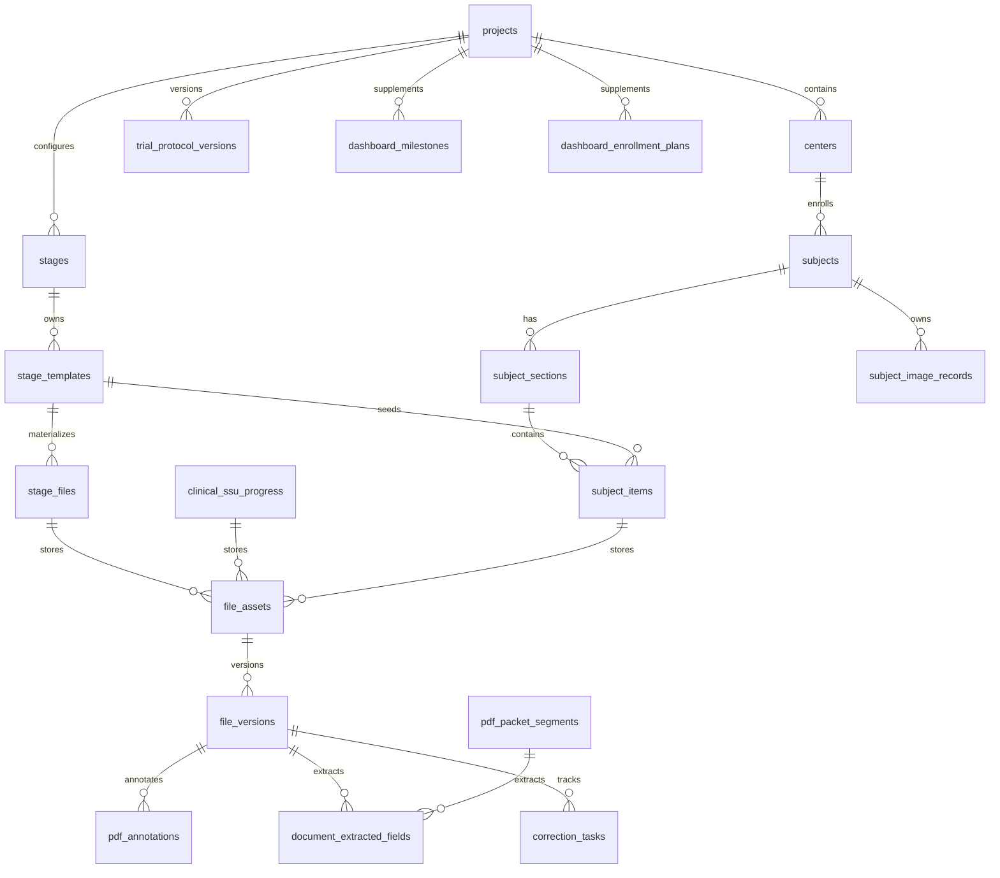

# 数据库字段设计

本文是 `clinical-data-system` 的数据库字段设计基线，服务于后续临床数据集字段提取、看板汇总、研发对接和数据口径审查。本文优先记录当前已落库结构；尚未落库但已明确会影响字段提取的内容放在“规划字段”章节，不代表本轮已经实现。

## 1. 总体关系

核心实体关系：

统一字段约定：

- `id`：整型主键，所有业务表使用自增主键。
- `project_id`：项目范围字段，用于权限隔离和看板聚合。
- `center_id`：中心范围字段；为空时通常表示项目级记录。
- `created_at` / `updated_at`：系统时间字段；导入、接口维护和自动补齐都应更新 `updated_at`。
- 状态字段使用短编码存储，前端/文档负责显示中文标签。

## 2. 身份权限

| 表 | 粒度 | 关键字段 | 业务说明 |
| --- | --- | --- | --- |
| `users` | 用户 | `username`, `full_name`, `email`, `hashed_password`, `is_active` | 登录账号与人员身份。 |
| `roles` | 角色 | `name`, `label`, `system` | 系统角色包括管理员、项目负责人、中心负责人、协调员、审核人员、研发、只读。 |
| `permissions` | 权限点 | `code`, `label`, `module` | 接口和菜单权限来源。 |
| `user_roles` | 用户-角色 | `user_id`, `role_id` | 多角色绑定。 |
| `role_permissions` | 角色-权限 | `role_id`, `permission_id` | 角色默认权限和自定义权限。 |
| `user_project_scopes` | 用户-项目范围 | `user_id`, `project_id` | 项目负责人写范围；V3.2.3 看板维护按此限制。 |
| `user_center_scopes` | 用户-中心范围 | `user_id`, `center_id` | 中心级查看和资料维护范围。 |

权限口径：

- `dashboard:read`：查看纯展示看板。
- `dashboard:write`：旧看板维护权限，但 V3.2.3 起写入还必须满足管理员或 `project_manager` 角色。
- `trial_protocol_versions` 写入：管理员可维护全部项目；项目负责人仅可维护 `user_project_scopes` 内项目。
- `image_data:read`：查看图像数据状态和元数据。
- `image_data:upload_raw`：上传或下载原始图像记录。
- `image_data:copy_raw`：研发原始图像副本下载入口，不修改原始记录文件。
- `image_data:upload_enhanced`：上传或下载增强图像记录。
- `image_data:upload_report`：上传或下载电子报告。
- `image_data:delete`：清空图像数据记录。
- 管理员忽略项目/中心范围；项目负责人只能写 `user_project_scopes` 内项目。

## 3. 主数据与模板

| 表 | 粒度 | 关键字段 | 业务说明 |
| --- | --- | --- | --- |
| `projects` | 项目 | `name`, `code`, `status`, `stage_template_defaults_initialized` | 临床试验项目根对象。 |
| `trial_protocol_versions` | 项目方案版本 | `project_id`, `version_number`, `original_name`, `storage_path`, `file_hash`, `page_count`, `parsing_status`, `protocol_no`, `protocol_version`, `protocol_date`, `draft_json`, `apply_result_json`, `uploaded_by`, `applied_by`, `uploaded_at`, `applied_at` | 项目级临床试验方案 PDF 版本、解析草稿和应用结果。 |
| `centers` | 项目下中心 | `project_id`, `name`, `code`, `contact_person`, `status` | 中心机构和项目执行点。 |
| `stages` | 项目阶段 | `project_id`, `name`, `code`, `parent_id`, `phase_code`, `option_code`, `is_system`, `enabled`, `sort_order` | 三大阶段和二级阶段；V1-V4 访视为系统固定结构。 |
| `stage_templates` | 阶段资料模板 | `project_id`, `stage_id`, `item_name`, `item_code`, `template_scope`, `required`, `recognition_keywords` | 生成中心级资料或受试者资料项的模板。 |
| `dictionaries` | 字典项 | `dict_type`, `value`, `label`, `color`, `enabled`, `sort_order` | 状态、标签、显示颜色等可维护字典。 |

关键唯一性：

- `projects.code` 唯一。
- `trial_protocol_versions(project_id, version_number)` 唯一。
- `centers(project_id, code)` 唯一。
- `stages(project_id, code)` 唯一。
- `stage_templates(stage_id, item_code)` 唯一。

## 4. 临床数据集

| 表 | 粒度 | 关键字段 | 业务说明 |
| --- | --- | --- | --- |
| `subjects` | 受试者 | `project_id`, `center_id`, `screening_no`, `subject_arm`, `gender`, `age`, `enrolled_at`, `informed_at`, `visit1_date`-`visit5_date`, `review_status`, `data_status`, `completed_at` | 受试者主记录，看板自动汇总入组、完成率和趋势。 |
| `subject_sections` | 受试者访视阶段 | `project_id`, `stage_id`, `subject_id`, `section_code`, `name`, `visit_name`, `time_window`, `sort_order` | 优先承载已应用方案访视；无方案项目使用默认访视兜底。 |
| `subject_items` | 受试者资料项 | `subject_id`, `section_id`, `stage_template_id`, `item_name`, `item_code`, `required`, `upload_status`, `review_status`, `remark` | 受试者级资料上传、审核和完整性计算。 |
| `stage_files` | 中心级阶段资料 | `project_id`, `center_id`, `stage_id`, `stage_template_id`, `file_name`, `file_type`, `required`, `upload_status`, `review_status`, `not_applicable`, `not_applicable_reason`, `remark` | 中心级资料项，支持“若有”资料声明无此材料，可与 SSU 文件显示同名互通提示但不共用归属。 |
| `clinical_ssu_progress` | SSU 节点进展 | `project_id`, `center_id`, `stage_code`, `status`, `submitted_at`, `approved_at`, `completed_at`, `version_info`, `file_checklist`, `summary`, `fee_detail`, `notes` | 试验准备阶段 SSU 进展人工维护，可独立挂载多份 `ssu_document` PDF 文件。 |
| `subject_image_records` | 受试者图像数据 | `project_id`, `center_id`, `subject_id`, `image_type`, `screening_no_snapshot`, `upload_status`, `original_name`, `storage_path`, `file_hash`, `file_size`, `version`, `extracted_dir`, `image_count`, `image_total_size`, `image_extensions_json`, `parse_warning`, `source_raw_record_id`, `uploaded_by`, `uploaded_at`, `copied_by`, `copied_at` | 按试验序列号管理原始图像、增强图像和电子报告。 |

状态口径：

- `upload_status`：`not_uploaded`、`uploaded`、`supplement_required`、`replaced`。
- `review_status`：`unreviewed`、`pending`、`approved`、`rejected`。
- `data_status`：`incomplete`、`checking`、`complete`。
- `not_applicable=true` 只适用于非必填资料；已有上传文件时不能声明无此材料。

图像数据口径：

- `subject_image_records(subject_id, image_type)` 唯一，`image_type` 取 `raw`、`enhanced`、`report`。
- 新增受试者时生成三类记录；历史受试者访问图像列表时懒补齐；删除受试者时级联删除图像记录。
- 原始/增强图像以 zip 上传，保存原始包并安全解包统计图片数量、图片总大小和扩展名分布。
- 单文件业务上限为 `3072MB`；增强图像必须在对应原始图像已上传后才能上传。
- `source_raw_record_id` 用于增强图像关联来源原始图像记录；研发下载原始副本时只写 `copied_by/copied_at` 和操作日志。
- zip 根目录名与 `screening_no_snapshot` 不一致时写入 `parse_warning`，不阻断保存；路径穿越或非法 zip 会拒绝上传。

## 5. 文件、审核与整改

| 表 | 粒度 | 关键字段 | 业务说明 |
| --- | --- | --- | --- |
| `file_assets` | 当前文件 | `project_id`, `center_id`, `stage_id`, `stage_file_id`, `ssu_progress_id`, `subject_id`, `subject_item_id`, `file_category`, `original_name`, `storage_path`, `mime_type`, `version`, `uploaded_by` | 当前有效文件记录，可绑定中心级资料项、SSU 节点或受试者资料项，三种归属互斥。 |
| `file_versions` | 文件版本 | `file_id`, `version`, `original_name`, `storage_path`, `mime_type`, `file_size`, `uploaded_by`, `change_note` | 文件历史版本；PDF 批注绑定具体版本。 |
| `review_records` | 审核记录 | `target_type`, `target_id`, `action`, `review_status`, `reviewer_id`, `comment` | 资料提交、通过、驳回记录。 |
| `pdf_annotations` | PDF 批注 | `file_id`, `file_version_id`, `page_number`, `x`, `y`, `width`, `height`, `comment`, `status`, `created_by` | 在线 PDF 框选批注。 |
| `correction_tasks` | 整改任务 | `project_id`, `center_id`, `subject_id`, `subject_item_id`, `stage_file_id`, `source_file_version_id`, `latest_file_version_id`, `status`, `title`, `description` | 批注生成的整改闭环任务。 |
| `correction_task_annotations` | 任务-批注关联 | `task_id`, `annotation_id` | 一个整改任务关联多个批注。 |

文件口径：

- `file_assets.version` 指当前版本号。
- `file_versions(file_id, version)` 唯一。
- 整改重传创建新 `file_versions`，并更新 `correction_tasks.latest_file_version_id`。

## 6. PDF 资料包

| 表 | 粒度 | 关键字段 | 业务说明 |
| --- | --- | --- | --- |
| `pdf_packets` | PDF 资料包 | `project_id`, `center_id`, `subject_id`, `original_name`, `storage_path`, `status`, `ocr_status`, `created_by`, `confirmed_at` | 整包上传、OCR、切分和确认入口。 |
| `pdf_packet_segments` | 资料包片段 | `packet_id`, `segment_no`, `start_page`, `end_page`, `document_type`, `stage_template_id`, `subject_item_id`, `stage_file_id`, `status`, `reason`, `uploaded_file_id` | OCR 后连续页片段，可人工拆分、合并、修正和上传入库。 |
| `document_extracted_fields` | 文件/片段字段证据 | `file_version_id`, `pdf_packet_segment_id`, `document_type`, `field_key`, `field_label`, `value_type`, `raw_value`, `normalized_value`, `source_page_no`, `source_text`, `confidence`, `status`, `manually_edited`, `confirmed_by`, `confirmed_at`, `updated_by` | 保存自动提取和人工核查结果，归属到文件版本或资料包片段。 |

片段口径：

- 页码使用 1-based。
- 已确认片段默认受保护；强制重新识别才覆盖人工结果。
- 片段可绑定模板或资料项，最终上传后写入文件体系并复制已核查字段。
- 通用分类规则命中后必须二次匹配当前受试者的 `subject_items`；当前受试者不存在的旧资料项不能生成建议 ID。
- `document_extracted_fields` 的文件版本归属和资料包片段归属二选一，同一归属下 `field_key` 唯一。
- 日期时间规范值使用 ISO 形式保存，展示层统一格式化；人工修改保留 `manually_edited`、更新人和确认信息。

## 7. 看板

V3.2.3 看板分为纯展示和手工维护两层：

- 展示看板优先从临床数据集、资料完整性、审核记录自动汇总。
- 手工维护表保留为计划、结果、事件和风险的补充数据源。

| 表 | 粒度 | 关键字段 | 业务说明 |
| --- | --- | --- | --- |
| `dashboard_milestones` | 项目/中心里程碑 | `project_id`, `center_id`, `milestone_name`, `planned_date`, `actual_date`, `status`, `owner`, `notes` | 甘特图、预期偏离预警。 |
| `dashboard_enrollment_plans` | 项目/中心入组计划 | `project_id`, `center_id`, `contract_count`, `screening_count`, `current_enrolled_count`, `positive_enrolled_count`, `next_week_plan_count`, `eligible_count` | 合同例数、计划入组等数据集暂缺字段。 |
| `dashboard_subject_overviews` | 受试者整体情况 | `project_id`, `center_id`, `screening_no`, `informed_at`, `swallow_time`, `capsule_serial_no`, `image_count`, `video_duration`, `capsule_excreted_at` | 胶囊、记录仪和过程信息。 |
| `dashboard_device_handovers` | 器械交接 | `project_id`, `center_id`, `device_name`, `batch_no`, `device_serial_no`, `handed_over_at`, `returned_at`, `handover_status` | 器械交接和归还。 |
| `dashboard_subject_results` | 受试者结果 | `project_id`, `center_id`, `screening_no`, `reading_no`, `whole_colon_completed`, `is_positive`, `capsule_polyp_count`, `matched_polyp_count` | 结果统计、匹配和阳性判断。 |
| `dashboard_clinical_events` | 临床事件 | `project_id`, `center_id`, `event_name`, `occurred_at`, `event_type`, `severity`, `status`, `notes` | 临床事件、SAE 或其他风险事件。 |
| `dashboard_device_issues` | 器械问题 | `project_id`, `center_id`, `problem_time`, `problem_description`, `is_resolved`, `problem_type`, `center_institution` | 器械问题和解决情况。 |
| `dashboard_important_tasks` | 重要紧急事项 | `project_id`, `center_id`, `title`, `owner`, `planned_due_date`, `actual_completed_date`, `status`, `importance`, `urgency` | 管理事项和计划预警。 |

## 8. 操作日志

| 表 | 粒度 | 关键字段 | 业务说明 |
| --- | --- | --- | --- |
| `operation_logs` | 一次操作 | `actor_id`, `action`, `target_type`, `target_id`, `project_id`, `center_id`, `detail`, `ip_address`, `user_agent` | 主数据、资料、审核、导入导出等关键操作追踪。 |

日志口径：

- `detail` 保存结构化 JSON。
- 生产问题追溯优先通过 `action + target_type + project_id/center_id` 定位。

## 9. 结构化字段目录与后续主表字段

以下字段是字段提取和研发对接的稳定候选编码。V3.5 已可将其作为 `document_extracted_fields` 记录持久化，但并不表示每个字段都已经提升为受试者或看板主表的独立业务列。新增主表列前仍需确认来源资料、人工复核规则和字段类型。

| 领域 | 字段编码 | 建议类型 | 来源资料 | 业务用途 |
| --- | --- | --- | --- | --- |
| 入组 | `enrollment_no` | text | 入组审核记录表、筛选入选表 | 区分筛选号和正式入组编号。 |
| 知情 | `icf_signed_at` | datetime | 知情同意书 | 判断知情时间是否早于试验操作。 |
| 知情 | `icf_version` | text | 知情同意书、伦理批件 | 知情版本一致性核查。 |
| 检查 | `ct_exam_at` | datetime | CT 报告 | 影像检查时间轴。 |
| 检查 | `ct_key_findings` | text | CT 报告 | 重要检查结论提取。 |
| 胶囊 | `capsule_swallowed_at` | datetime | HIS、胶囊内镜报告 | 胶囊吞服时间。 |
| 胶囊 | `capsule_excreted_at` | datetime | 胶囊内镜报告 | 排出时间和完整性判断。 |
| 胶囊 | `image_count` | integer | 胶囊内镜报告 | 看板图像数量。 |
| 胶囊 | `video_duration` | text | 胶囊内镜报告 | 视频时长。 |
| 结果 | `whole_colon_completed` | boolean/text | 阅片评价、结果统计表 | 全结肠完成判断。 |
| 结果 | `is_positive` | boolean/text | 结果统计表 | 阳性入组和结果统计。 |
| 结果 | `capsule_polyp_count` | integer | 结果统计表 | 胶囊识别息肉数量。 |
| 结果 | `colonoscopy_polyp_count` | integer | 结果统计表 | 肠镜息肉数量。 |
| 结果 | `matched_polyp_count` | integer | 匹配结果表 | 匹配数量。 |
| 安全 | `adverse_event_name` | text | SAE 报告、临床事件记录 | 安全事件统计。 |
| 安全 | `adverse_event_severity` | text | SAE 报告 | 严重程度。 |
| 器械 | `device_batch_no` | text | 器械交接单 | 批次追溯。 |
| 器械 | `device_serial_no` | text | 器械交接单 | 单台设备追溯。 |
| 器械 | `device_issue_type` | text | 器械问题记录 | 问题分类统计。 |

规划字段落库原则：

1. 字段必须可追溯到文件、页码或人工录入来源。
2. 自动抽取结果必须支持人工修正，并记录最后确认人和确认时间。
3. 看板优先读取结构化字段；字段暂缺时才读取手工维护表。
4. 研发对接字段编码使用英文稳定编码，中文标签只作为展示层。
